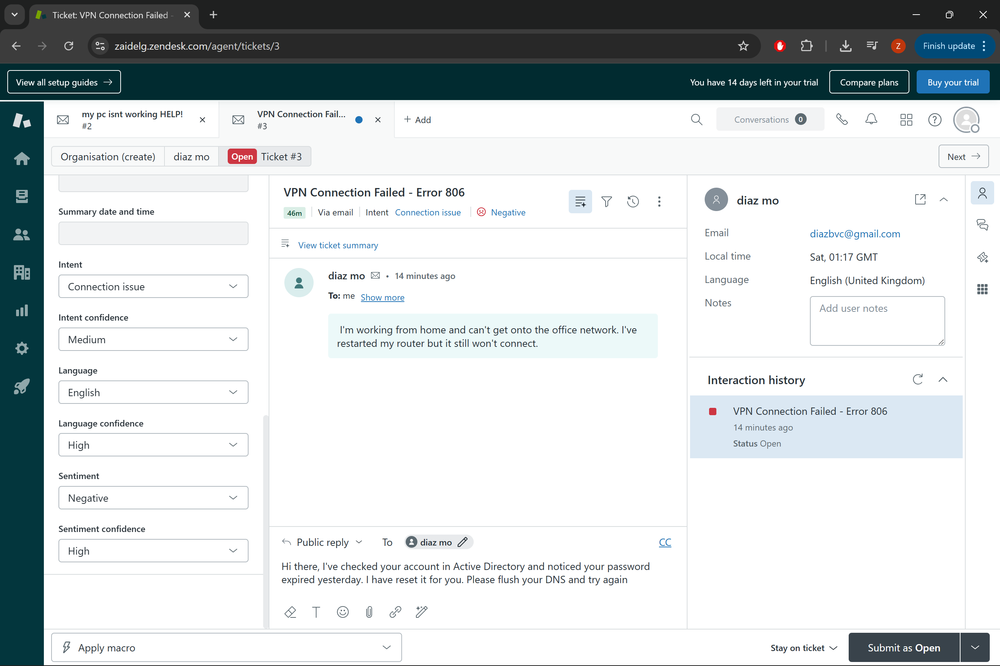
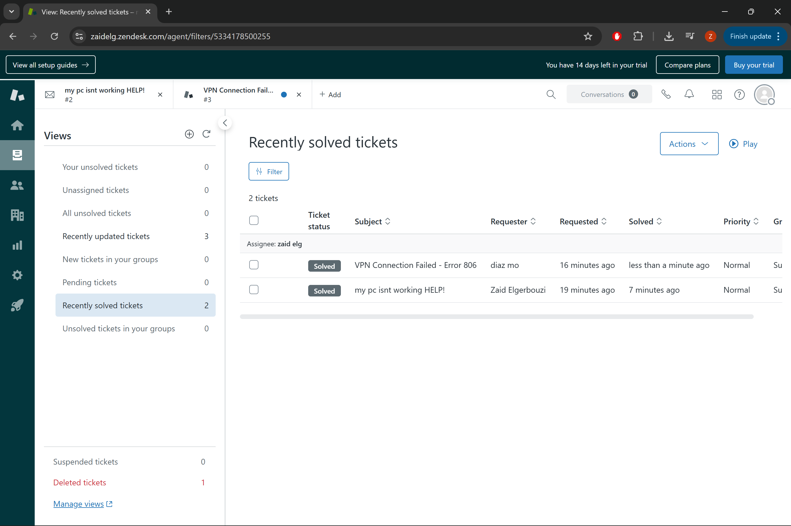

1. Enterprise Ticketing & Troubleshooting (Zendesk)
* **Goal:** Simulate real-world helpdesk scenarios using an industry-standard ITSM tool.
* **Skills:** Ticket lifecycle management, professional communication, and technical documentation.
* **Key Achievement:** Successfully resolved "High Priority" connectivity issues using the CompTIA troubleshooting methodology.

#### 📸 Lab Evidence: Ticket Lifecycle

**A. Technical Troubleshooting (Internal Note)**
*Documenting the technical root cause (DNS/Credential mismatch) for the engineering team.*

**B. Professional Communication (Public Reply)**
*Translating technical fixes into clear, actionable instructions for the end-user.*

**C. Successful Resolution**
*Closing the loop and ensuring the ticket meets SLA requirements.*

